# 🧭 Convoscope


**Convoscope** is a resilient, multi-provider AI chat application. It automatically falls back between **OpenAI**, **Anthropic**,
and **Google Gemini** so conversations continue even when an API has a bad day. The project showcases the full journey from
monolithic prototype to production-grade system—complete with architecture docs, testing strategy, and a rich visual gallery.


> 📘 Full documentation: **https://docs.barbhs.com/convoscope**

## 📌 Quick Links

- [Architecture overview](docs/architecture/system-overview.md)
- [Technical decisions (TDRs)](docs/architecture/technical-decisions.md)
- [API and service documentation](docs/api/llm-service.md)
- [Model comparison workflow](docs/guides/model-comparison.md)
- [Visual assets index](docs/visual-assets-index.md)

---

## 🚀 Overview

| Built For | What You’ll See | Why It Matters |
|-----------|-----------------|----------------|
| **Reliability** | Automatic provider fallback, graceful degradation, persistent conversations | 99.9% uptime architecture keeps chats online |
| **Developer Experience** | Modular services, typed interfaces, 80+ automated tests, Playwright coverage | Production-ready LLM patterns you can reuse |
| **Portfolio Storytelling** | Before/after metrics, refactoring journey, MkDocs site | Demonstrates systems thinking and professional polish |

---

## ✨ Highlights

- 🔄 **Multi-provider routing** with circuit breaker logic and warm failovers
- 💾 **Conversation management** (save, reload, export, and auto-backups)
- 🧪 **80+ automated tests** across unit, integration, and Playwright suites
- 🧭 **Documentation-first** approach with diagrams, TDRs, and visual indices
- 🎨 **Polished Streamlit UI** with responsive design and configurable theming

---

## 📸 Visual Tour

All screenshots live in [`docs/assets/screenshots/`](docs/assets/screenshots/) and are catalogued in the
[Visual Assets Index](docs/visual-assets-index.md).

| Feature | Screenshot | Description |
|---------|------------|-------------|
| **Hero Interface** |  | Primary chat layout with provider context and conversation tools |
| **Provider Selection** |  | Dropdown for OpenAI, Anthropic, and Gemini with status indicators |
| **Full Interface** |  | Complete layout showing chat history, prompts, and settings |
| **Error Handling** |  | Friendly recovery messages when providers fail |
| **Mobile Responsive** |  | Narrow viewport experience for phones and tablets |
| **Compare View** |  | Side-by-side evaluation and blind scoring mode |
| **Results Viewer** |  | Filterable experiment logs with CSV export |

---

## 🏗️ Architecture & Reliability

```mermaid
flowchart TB
    subgraph Frontend ["🎨 Streamlit UI"]
        UI["📱 Interface & Session State"]
    end

    subgraph Services ["⚙️ Core Services"]
        LLM["🤖 LLM Router"]
        CONV["💬 Conversation Manager"]
        ERR["🛡️ Error Handling & Circuit Breaker"]
    end

    subgraph Storage ["💾 Persistence"]
        FILES["📁 Conversation Store"]
        BACKUPS["🛟 Auto-Backups"]
    end

    subgraph Providers ["🌐 AI Providers"]
        OPENAI["🔥 OpenAI"]
        ANTHROPIC["🧠 Anthropic"]
        GOOGLE["🌟 Google Gemini"]
    end

    UI --> LLM
    UI --> CONV
    LLM <--> ERR
    LLM --> OPENAI
    LLM --> ANTHROPIC
    LLM --> GOOGLE
    CONV --> FILES
    CONV --> BACKUPS
```



- Intelligent fallback keeps conversations live during outages
- Service-oriented architecture replaced a 696-line monolith (42% code reduction)
- Detailed diagrams and TDRs document the refactoring journey

See the [system overview](docs/architecture/system-overview.md) and [technical decisions](docs/architecture/technical-decisions.md)
for the full breakdown.

---

## 🧪 Testing & Quality

```bash
pytest tests/ -v
pytest --cov=src --cov-report=html
```

- 50+ unit tests with comprehensive mocking
- 20+ integration & Playwright tests for UI flows
- Coverage routinely >95%
- `run_tests.py` orchestrates local and CI suites

Explore the [codebase metrics](docs/metrics/codebase-analysis.md) for coverage, complexity, and maintainability details.

---

## ⚡ Quick Start

```bash
git clone https://github.com/dagny099/convoscope.git
cd convoscope
python -m venv .venv
source .venv/bin/activate   # Windows: .venv\Scripts\activate
pip install -r requirements.txt
cp .env.example .env        # add your API keys
```

Run the app:

```bash
streamlit run run_chat.py
```

Visit **http://localhost:8501** and start chatting. Need more? See the
[Installation Guide](docs/guides/installation.md) and [Multi-Provider Setup](docs/guides/multi-provider-setup.md).

---

## 📚 Documentation Map

| Topic | Start Here |
|-------|------------|
| **User onboarding** | [docs/index.md](docs/index.md) |
| **Configuration & troubleshooting** | [docs/guides/](docs/guides/) |
| **Architecture deep-dive** | [docs/architecture/system-overview.md](docs/architecture/system-overview.md) |
| **API & services** | [docs/api/llm-service.md](docs/api/llm-service.md) |
| **Metrics & testing** | [docs/metrics/codebase-analysis.md](docs/metrics/codebase-analysis.md) |
| **Portfolio narrative** | [docs/portfolio-showcase.md](docs/portfolio-showcase.md) |
| **Visual asset inventory** | [docs/visual-assets-index.md](docs/visual-assets-index.md) |

---

## 🧭 Project Story

What began as a single 696-line Streamlit script evolved into a modular platform with service abstraction, circuit breaker
patterns, and CI-ready tests. The documentation captures each step of that transformation—ideal for recruiters, interviewers,
and fellow builders who want to see the before/after impact.

Follow the journey in the [blog series](docs/blog/) and the [project details](docs/project-details/) section.

---

## 📜 License

MIT — free to explore, adapt, and learn from.
