# 🧭 Convoscope


**Convoscope** is a multi-provider AI chat interface built with **Streamlit**.  
It supports **OpenAI, Anthropic, and Google Gemini** models, provides **persistent conversation management**, and demonstrates **production-grade engineering practices** for LLM applications.

---

## 🚀 App in Action

📸 *[Insert screenshot or animated GIF of a conversation here]*

Showcases:
- Real-time streaming responses
- Provider switching
- Conversation history and export

---

## ⚡ Quick Start

Clone the repo and launch in minutes.

```bash
git clone https://github.com/dagny099/convoscope.git
cd convoscope
python -m venv .venv
source .venv/bin/activate   # Windows: .venv\Scripts\activate
pip install -r requirements.txt
cp .env.example .env        # add your API keys
```

Run the app:

```bash
streamlit run run_chat.py
```

👉 Visit: [http://localhost:8501](http://localhost:8501)

---

## ✨ Features at a Glance

- 🔄 **Multi-Provider LLMs** — OpenAI, Anthropic, and Gemini with automatic fallback  
- 💾 **Conversation Management** — save, reload, and export sessions  
- 🛡️ **Production-Ready Reliability** — input validation, logging, error recovery, rate-limit handling  
- 🎨 **Polished UI/UX** — responsive layout, dark/light mode, provider status indicators  
- 🧪 **Robust Testing** — 50+ unit tests, 20+ integration tests (Playwright + pytest)  
- 📑 **Extensive Documentation** — MkDocs site with diagrams, metrics, and examples  

---

## 🏗️ High-Level Architecture

_Provider abstraction with intelligent fallback; UI and session separated from services and storage._

```mermaid
flowchart TB
    subgraph Frontend ["🎨 Frontend Layer"]
        UI["📱 Streamlit UI"]
        SESSION["📋 Session Management"]
    end

    subgraph Services ["⚙️ Service Layer"]
        LLM["🤖 LLM Service"]
        CONV["💬 Conversation Manager"]
        ERROR["⚠️ Error Handler"]
    end

    subgraph Storage ["💾 Storage Layer"]
        FILES["📁 File Storage"]
        CONVDB["📊 Conversation Data"]
    end

    subgraph External ["🌐 External APIs"]
        OPENAI["🔥 OpenAI API"]
        ANTHROPIC["🧠 Anthropic API"]
        GOOGLE["🌟 Google Gemini"]
    end

    UI <--> SESSION
    UI --> LLM
    UI --> CONV

    LLM <--> ERROR
    LLM --> OPENAI
    LLM --> ANTHROPIC
    LLM --> GOOGLE

    CONV --> FILES
    CONV --> CONVDB
    SESSION --> CONV

    classDef frontend fill:#e3f2fd,stroke:#1976d2,stroke-width:2px
    classDef services fill:#f3e5f5,stroke:#7b1fa2,stroke-width:2px
    classDef storage fill:#fff3e0,stroke:#f57c00,stroke-width:2px
    classDef external fill:#e8f5e8,stroke:#388e3c,stroke-width:2px

    class UI,SESSION frontend
    class LLM,CONV,ERROR services
    class FILES,CONVDB storage
    class OPENAI,ANTHROPIC,GOOGLE external
```



➡️ Deeper dive: **[Architecture Docs](docs/architecture.md)**

---

## 🔄 End-to-End Data Flow

_Validation → routing → streaming → persistence → recovery._

```mermaid
flowchart TD
    A[🧑‍💻 User Input] --> B[🔎 Input Validation]
    B --> |Valid| C[🧠 Session State Check]
    B --> |Invalid| D[❌ User-Friendly Error]

    C --> E[🤖 LLM Router]
    E --> F{Provider Available?}

    F --> |OpenAI| G[🔥 OpenAI API]
    F --> |OpenAI Failed| H[🧠 Anthropic Fallback]
    F --> |All Failed| I[🚨 Error Handler]

    G --> J[🧵 Response Processing]
    H --> J
    I --> K[❗ User Error Message]

    J --> L[🔊 Stream to UI]
    J --> M[💾 Save to Conversation Manager]

    M --> N[📁 File Storage]
    M --> O[🛟 Auto-save Backup]

    L --> P[📺 Display to User]
    N --> Q[🗂️ Conversation History]
    O --> R[🧯 Recovery System]

    style A fill:#e1f5fe
    style P fill:#e8f5e8
    style K fill:#ffebee
    style I fill:#ffebee
```



➡️ Deeper dive: **[Data Flow Docs](docs/data-flow.md)**

---

## 🧪 Testing & Quality

Run the test suite:

```bash
pytest tests/ -v
```

- 50+ **unit tests**  
- 20+ **integration tests** (Streamlit + Playwright)  
- Mocked LLMs for reproducibility  
- Coverage reports:  

```bash
pytest --cov=src --cov-report=html
```

---

## ⚙️ Configuration

Environment variables are stored in `.env`:

```ini
OPENAI_API_KEY=
ANTHROPIC_API_KEY=
GEMINI_API_KEY=
DEFAULT_LLM_PROVIDER=openai
DEFAULT_TEMPERATURE=0.7
MAX_CONVERSATION_HISTORY=100
```

Default provider/model priorities can be adjusted in `config.py`.

---

## 📚 Documentation

Convoscope is documented with **MkDocs**:

- Architecture diagrams  
- API usage examples  
- Before/after metrics and benchmarks  

👉 Explore the docs: [link being updated super shortly]

---

## 🎯 For Hiring Managers

This repository highlights my strengths in:

- **Design & Architecture** — modular refactoring from monolith  
- **Testing & Quality Engineering** — robust unit and integration testing  
- **Technical Writing** — professional docs with diagrams & examples  
- **System Integration** — multi-provider, resilient chat app design  

For more about my work, visit [my portfolio](https://barbhs.com).

---

## 🔮 Want the Backstory?

Convoscope started life as a 696-line monolith. Over time, I refactored it into a modular, testable, production-grade system.  

I’m writing a blog series about this journey:  
- Part 1: From Monolith to Modules  
- Part 2: Testing as a First-Class Citizen  
- Part 3: Fallbacks, Reliability, and UX Polish  

Stay tuned 👀

---

## 📜 License

MIT — free to use, adapt, and explore.
