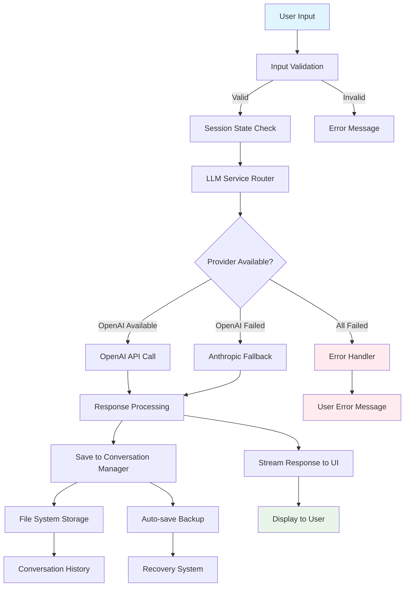
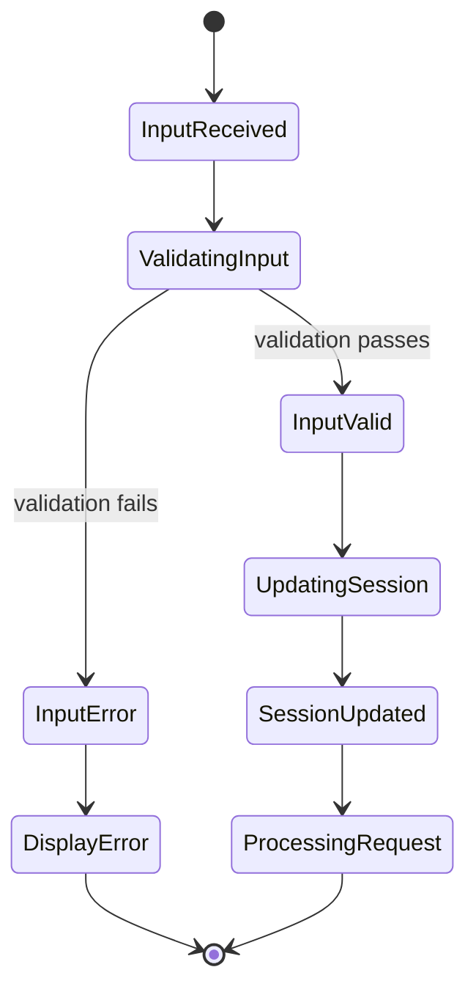
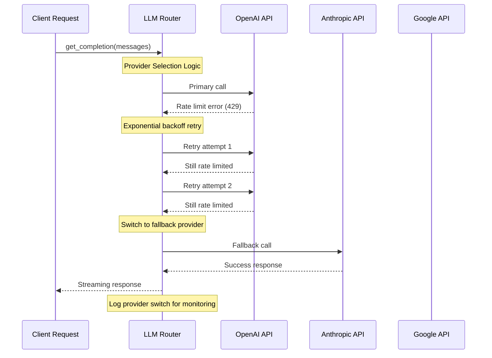
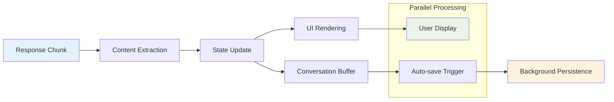
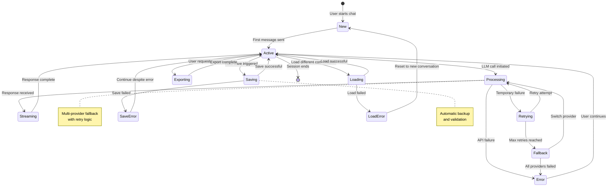
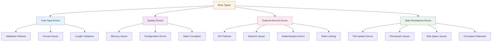
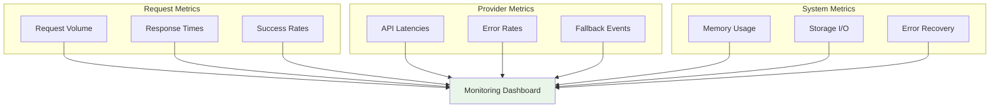

# Data Flow Architecture

## Request Processing Pipeline

The Convoscope application implements a sophisticated data flow that handles user interactions, LLM processing, and conversation persistence with robust error handling and state management.

## End-to-End Data Flow



## Detailed Processing Stages

### Stage 1: Input Processing & Validation

**Input Sanitization Pipeline**:
```python
def process_user_input(user_input: str) -> Tuple[bool, str, Optional[str]]:
    """Process and validate user input."""
    
    # 1. Basic validation
    if not user_input or not user_input.strip():
        return False, "Please enter a message", None
    
    # 2. Length validation  
    if len(user_input) > 10000:
        return False, "Message too long (max 10,000 characters)", None
    
    # 3. Content sanitization
    sanitized = user_input.strip()
    
    # 4. Format for LLM processing
    formatted_input = sanitized.replace('\n', ' ').strip()
    
    return True, "Input valid", formatted_input
```

**Session State Updates**:


### Stage 2: LLM Service Processing

**Provider Selection Logic**:
```python
def select_provider(self, request_context: Dict) -> str:
    """Intelligent provider selection based on multiple factors."""
    
    # 1. Check provider availability
    available_providers = self.get_available_providers()
    
    # 2. Apply selection criteria
    for provider in self.provider_priority:
        if provider in available_providers:
            # Check rate limits
            if not self.is_rate_limited(provider):
                # Check model compatibility
                if self.supports_model(provider, request_context.get('model')):
                    return provider
    
    # 3. Fallback to any available provider
    return available_providers[0] if available_providers else None
```

**Multi-Provider Fallback Sequence**:


### Stage 3: Response Processing & Streaming

**Streaming Response Architecture**:
```python
async def stream_response(self, provider_response):
    """Stream LLM response with real-time UI updates."""
    
    partial_response = ""
    
    for chunk in provider_response:
        # 1. Process chunk
        chunk_content = self.extract_content(chunk)
        partial_response += chunk_content
        
        # 2. Update session state
        self.update_conversation_state(partial_response)
        
        # 3. Stream to UI
        yield chunk_content
        
        # 4. Handle streaming errors
        if self.should_stop_stream(chunk):
            break
    
    # 5. Finalize response
    self.finalize_response(partial_response)
```

**Real-time State Management**:


### Stage 4: Conversation Persistence

**Data Persistence Pipeline**:
```python
def save_conversation_pipeline(self, conversation: List[Dict]) -> bool:
    """Multi-stage conversation persistence with validation."""
    
    # Stage 1: Data validation
    if not self.validate_conversation_structure(conversation):
        logger.error("Invalid conversation structure")
        return False
    
    # Stage 2: Prepare for persistence
    backup_created = self.create_backup_if_needed()
    
    try:
        # Stage 3: Atomic write operation
        self.write_conversation_atomically(conversation)
        
        # Stage 4: Verify write success
        if self.verify_write_integrity():
            self.cleanup_backup()
            return True
        else:
            raise WriteVerificationError("Write verification failed")
            
    except Exception as e:
        # Stage 5: Error recovery
        if backup_created:
            self.restore_from_backup()
        logger.error(f"Conversation save failed: {e}")
        return False
```

**Conversation State Lifecycle**:


## Error Handling & Recovery

### Comprehensive Error Classification



### Error Recovery Strategies

**Graceful Degradation Matrix**:

| Error Type | Immediate Action | Fallback Strategy | User Experience |
|------------|------------------|-------------------|-----------------|
| **API Rate Limit** | Exponential backoff | Switch provider | Transparent retry |
| **Provider Outage** | Circuit breaker | Fallback provider | Seamless transition |
| **Network Failure** | Retry with timeout | Offline mode | Clear status message |
| **Save Failure** | Backup restoration | In-memory retention | Warning notification |
| **Invalid Input** | Input validation | Format correction | Helpful guidance |

**Recovery Implementation**:
```python
class ErrorRecoveryManager:
    def handle_error(self, error: Exception, context: Dict) -> RecoveryAction:
        """Determine appropriate recovery action based on error type."""
        
        if isinstance(error, RateLimitError):
            return self.handle_rate_limit(error, context)
        elif isinstance(error, ProviderUnavailableError):
            return self.handle_provider_outage(error, context)
        elif isinstance(error, NetworkError):
            return self.handle_network_issue(error, context)
        elif isinstance(error, PersistenceError):
            return self.handle_save_failure(error, context)
        else:
            return self.handle_unknown_error(error, context)
    
    def handle_rate_limit(self, error, context):
        # Implement exponential backoff
        wait_time = min(60, 2 ** context.get('attempt', 0))
        return RecoveryAction(
            action="WAIT_AND_RETRY",
            delay=wait_time,
            fallback_provider=self.get_next_provider()
        )
```

## Performance Optimization Strategies

### Response Time Optimization

**Streaming Performance**:

```mermaid
gantt
    title Response Processing Timeline
    dateFormat X
    axisFormat %Ls
    
    section User Request
    Input Processing    :0, 50
    
    section LLM Processing  
    Provider Selection  :50, 100
    API Call           :100, 800
    First Chunk        :800, 850
    
    section UI Updates
    Stream Display     :850, 1200
    State Updates      :850, 1200
    
    section Background
    Auto-save         :1000, 1100
    Cleanup           :1100, 1150
```


**Caching Strategies**:
```python
class ResponseCache:
    """Intelligent caching for frequently requested content."""
    
    def __init__(self, max_size=1000, ttl=3600):
        self.cache = {}
        self.access_times = {}
        self.max_size = max_size
        self.ttl = ttl
    
    def get_cached_response(self, request_hash: str) -> Optional[str]:
        """Retrieve cached response if available and valid."""
        if request_hash in self.cache:
            cached_time = self.access_times[request_hash]
            if time.time() - cached_time < self.ttl:
                return self.cache[request_hash]
            else:
                # Expired cache entry
                del self.cache[request_hash]
                del self.access_times[request_hash]
        return None
```

### Memory Management

**Conversation Buffer Management**:
```python
def manage_conversation_buffer(self, max_messages=100):
    """Maintain optimal conversation buffer size."""
    
    if len(self.conversation_buffer) > max_messages:
        # Archive older messages
        archived_messages = self.conversation_buffer[:-max_messages]
        self.archive_messages(archived_messages)
        
        # Keep recent messages in memory
        self.conversation_buffer = self.conversation_buffer[-max_messages:]
        
        logger.info(f"Archived {len(archived_messages)} messages")
```

## Monitoring & Observability

### Data Flow Metrics



### Instrumentation Implementation

```python
from functools import wraps
import time

def monitor_data_flow(operation_name: str):
    """Decorator for monitoring data flow operations."""
    def decorator(func):
        @wraps(func)
        def wrapper(*args, **kwargs):
            start_time = time.time()
            
            try:
                result = func(*args, **kwargs)
                duration = time.time() - start_time
                
                logger.info(
                    "data_flow_operation",
                    operation=operation_name,
                    duration_ms=duration * 1000,
                    success=True
                )
                return result
                
            except Exception as e:
                duration = time.time() - start_time
                
                logger.error(
                    "data_flow_operation",
                    operation=operation_name,
                    duration_ms=duration * 1000,
                    success=False,
                    error_type=type(e).__name__,
                    error_message=str(e)
                )
                raise
        return wrapper
    return decorator

# Usage example
@monitor_data_flow("llm_completion")
def get_completion(self, provider, messages):
    # Implementation with automatic monitoring
    pass
```

This data flow architecture ensures reliable, performant, and observable request processing while maintaining clean separation of concerns and robust error handling throughout the pipeline.

---

*Next: [LLM Service Design](llm-service.md) - Deep dive into multi-provider integration architecture*