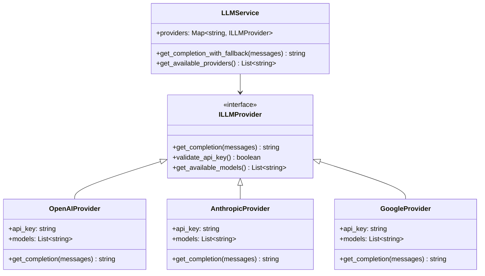
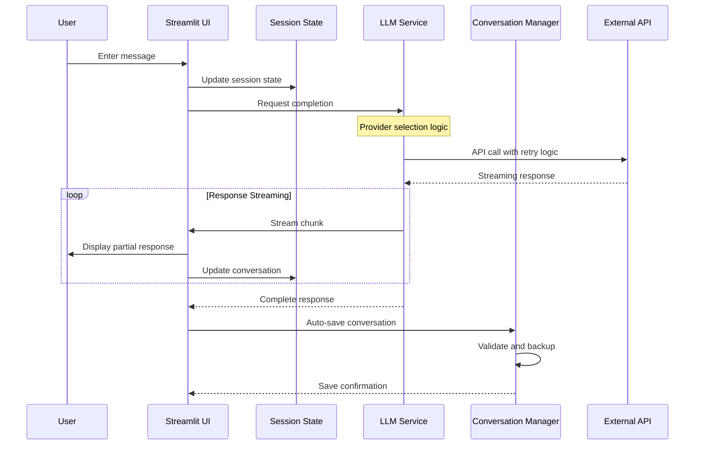
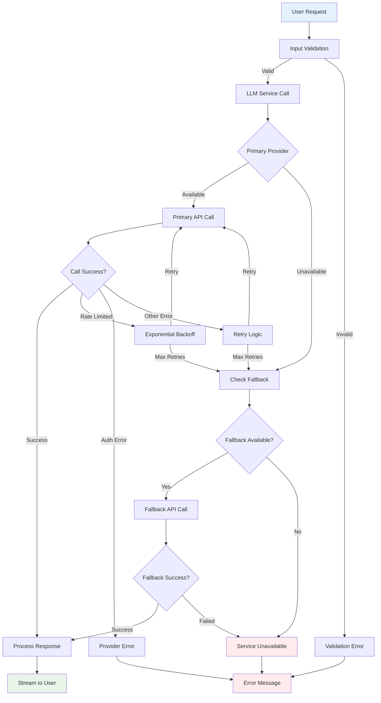
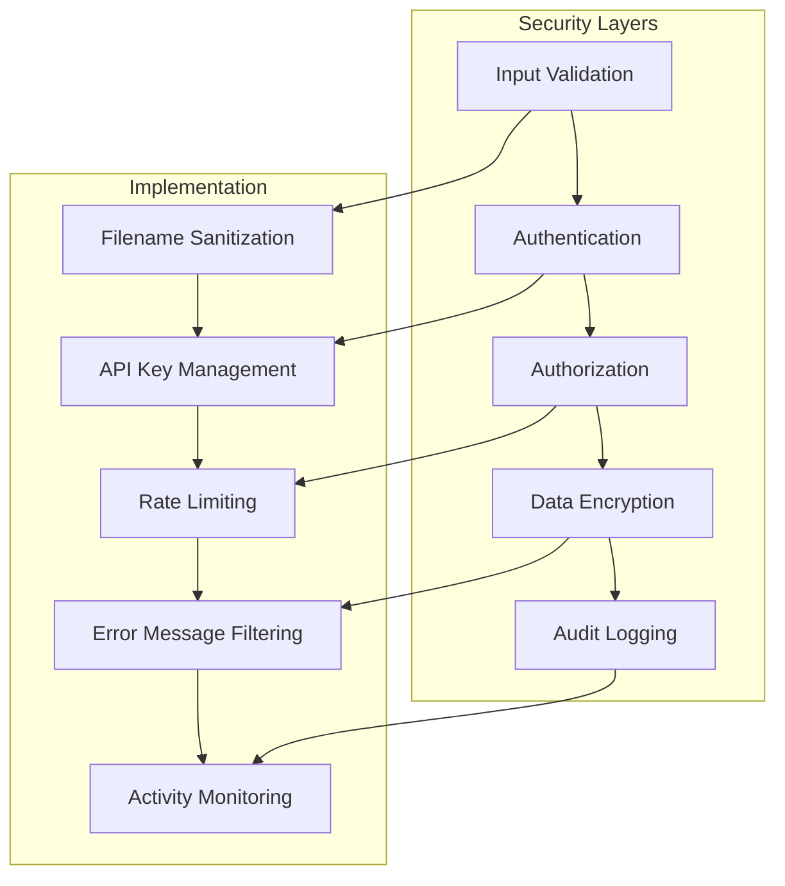
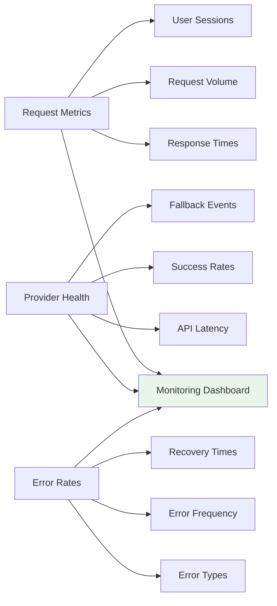

# System Architecture Overview

## High-Level Architecture

Convoscope implements a **layered service architecture** that separates concerns and enables maintainability, testability, and scalability. The system is designed around the principle of **provider abstraction** with **intelligent fallback mechanisms**.


## Architectural Principles

### 1. Separation of Concerns

Each layer has a distinct responsibility:

=== "🎨 Presentation Layer"
    
    **Streamlit UI Components**
    - User interface rendering and interaction handling
    - Session state management and persistence
    - Real-time response streaming and display
    - Input validation and user feedback
    
    ```python
    # Clean UI logic focused on presentation
    user_input = st.chat_input("Ask a question:")
    if user_input:
        with st.chat_message("user"):
            st.markdown(user_input)
        
        # Delegate business logic to service layer
        response = llm_service.get_completion_with_fallback(messages)
    ```

=== "⚙️ Service Layer"
    
    **Business Logic Services**
    - LLM provider management and routing
    - Conversation persistence and retrieval  
    - Error handling and recovery logic
    - Multi-provider fallback coordination
    
    ```python
    # Service layer handles complex business logic
    class LLMService:
        def get_completion_with_fallback(self, messages):
            """Intelligent provider selection with fallback."""
            try:
                return self.get_completion(self.primary_provider, messages)
            except LLMServiceError:
                return self.get_completion(self.fallback_provider, messages)
    ```

=== "💾 Data Layer"
    
    **Persistence & Storage**  
    - File system operations with atomic writes
    - Data validation and integrity checks
    - Backup and recovery mechanisms
    - Conversation metadata management
    
    ```python
    # Data layer focuses on reliable persistence
    def save_conversation(self, conversation, filename, create_backup=True):
        """Atomic save with backup and rollback capability."""
        # Implementation handles data integrity and error recovery
    ```

### 2. Provider Abstraction Pattern

The system implements a **unified provider interface** that abstracts away the differences between LLM providers:



## Component Interactions

### Request Processing Flow



### Error Handling Flow



## Service Design Patterns

### 1. Circuit Breaker Pattern

Prevents cascade failures by monitoring provider health:

```python
class ProviderCircuitBreaker:
    def __init__(self, failure_threshold=5, timeout=60):
        self.failure_count = 0
        self.failure_threshold = failure_threshold
        self.last_failure_time = None
        self.timeout = timeout
        self.state = "CLOSED"  # CLOSED, OPEN, HALF_OPEN
    
    def call(self, provider_function, *args, **kwargs):
        if self.state == "OPEN":
            if time.time() - self.last_failure_time > self.timeout:
                self.state = "HALF_OPEN"
            else:
                raise ProviderUnavailableError("Circuit breaker is OPEN")
        
        try:
            result = provider_function(*args, **kwargs)
            self.reset()
            return result
        except Exception as e:
            self.record_failure()
            raise
```

### 2. Retry with Exponential Backoff

Handles temporary failures gracefully:

```python
def get_completion_with_retry(self, provider, model, messages, max_retries=3):
    """Get completion with exponential backoff retry."""
    for attempt in range(max_retries):
        try:
            return self._make_api_call(provider, model, messages)
        except Exception as e:
            if self._is_retryable_error(e) and attempt < max_retries - 1:
                wait_time = (2 ** attempt) * 2  # Exponential backoff
                time.sleep(wait_time)
                continue
            raise
```

### 3. Factory Pattern for Provider Creation

Dynamic provider instantiation based on configuration:

```python
class LLMProviderFactory:
    @staticmethod
    def create_provider(provider_name: str) -> ILLMProvider:
        providers = {
            "openai": OpenAIProvider,
            "anthropic": AnthropicProvider, 
            "google": GoogleProvider
        }
        
        if provider_name not in providers:
            raise ValueError(f"Unknown provider: {provider_name}")
            
        provider_class = providers[provider_name]
        return provider_class.from_environment()
```

## Scalability Considerations

### Horizontal Scaling Patterns

The modular architecture supports multiple scaling approaches:

=== "🔄 Service Scaling"
    
    **Independent Service Scaling**
    - LLM Service can be scaled separately from UI components
    - Conversation Manager can handle increased persistence load
    - Provider services can be load-balanced independently
    
    ```python
    # Service instances can be distributed across processes/containers
    llm_service_pool = [
        LLMService(provider_config=config) 
        for _ in range(num_workers)
    ]
    ```

=== "📊 Load Distribution"
    
    **Provider Load Balancing**  
    - Distribute requests across multiple provider instances
    - Geographic routing to nearest provider endpoints
    - Cost-based routing (cheaper providers for non-critical requests)
    
    ```python
    def select_optimal_provider(self, request_context):
        """Select provider based on cost, latency, and availability."""
        available_providers = self.get_healthy_providers()
        return self.load_balancer.select(available_providers, request_context)
    ```

=== "💾 Data Scaling"
    
    **Storage Scaling Strategies**
    - Conversation partitioning by user/date
    - Asynchronous backup processes  
    - Database migration path for high-volume scenarios
    
    ```python
    # Partitioned storage structure
    conversation_path = f"{base_dir}/{user_id}/{date.year}/{date.month}/{filename}"
    ```

## Security Architecture

### Defense in Depth

Multiple security layers protect the system:



### Key Security Features

**Input Sanitization**:
- Filename sanitization prevents directory traversal
- Message content validation prevents injection attacks
- File size limits prevent resource exhaustion

**API Security**:
- Environment-based API key management
- No hardcoded credentials in codebase
- Graceful degradation when keys unavailable

**Data Protection**:
- JSON file integrity validation
- Atomic write operations prevent corruption
- Backup mechanisms enable recovery from failures

## Monitoring & Observability

### Metrics Collection Points



### Logging Strategy

**Structured Logging** for operational insights:

```python
import structlog

logger = structlog.get_logger()

def log_provider_call(self, provider, model, success, duration):
    logger.info(
        "llm_provider_call",
        provider=provider,
        model=model, 
        success=success,
        duration_ms=duration,
        fallback_used=self.fallback_activated
    )
```

This architecture provides a solid foundation for scaling while maintaining code quality, operational visibility, and system reliability.

---

*Next: [Data Flow](data-flow.md) - Detailed request processing pipeline and state management*