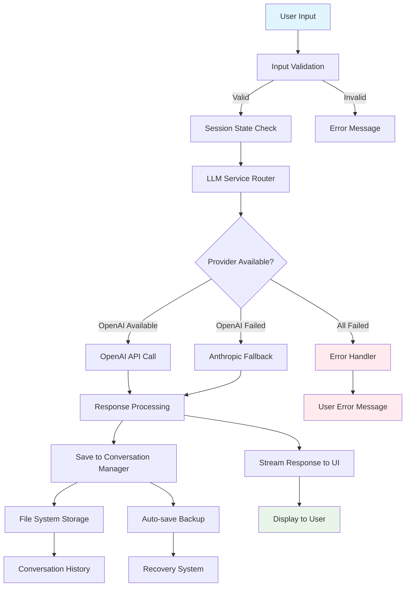
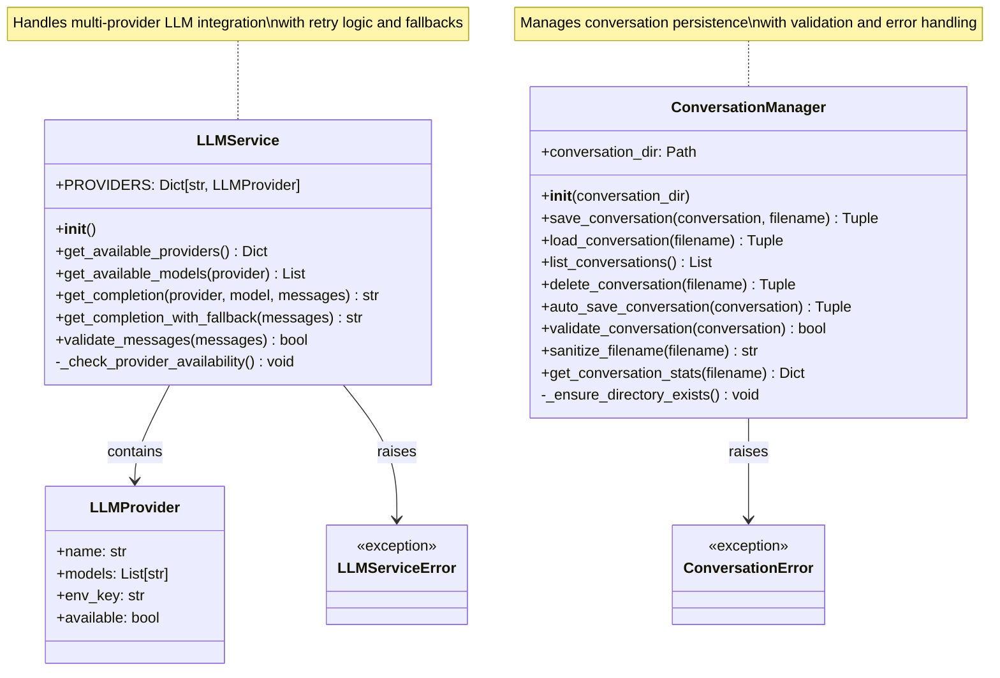
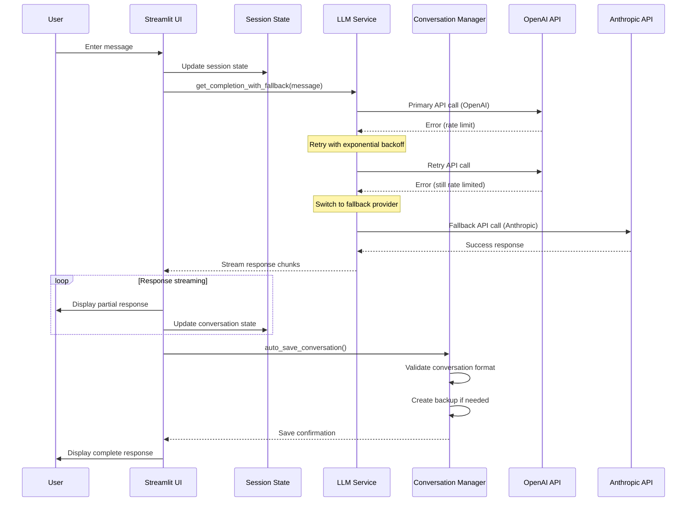
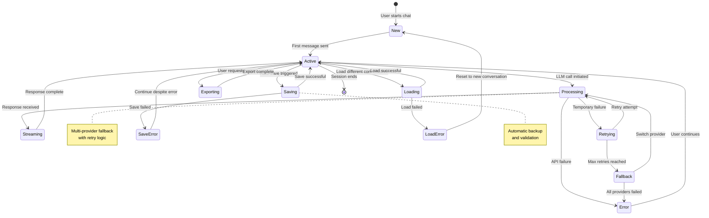
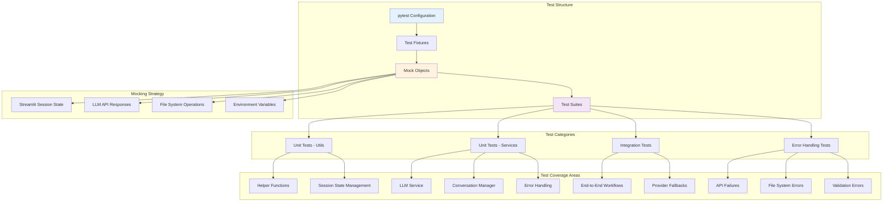

# Technical Architecture Diagrams for Convoscope Documentation

This file contains all the Mermaid diagrams planned for the MkDocs documentation. These diagrams will be embedded directly in the documentation pages.

## 1. System Architecture Diagram


## 2. Data Flow Diagram



## 3. LLM Service Class Diagram



## 4. User Interaction Sequence Diagram



## 5. Conversation Lifecycle State Diagram



## 6. Testing Architecture Diagram



## 7. Deployment & CI/CD Architecture

```mermaid
gitgraph
    commit id: "Initial Monolith"
    branch feature-refactor
    checkout feature-refactor
    commit id: "Extract Utils"
    commit id: "Add Tests"
    commit id: "LLM Service"
    commit id: "Error Handling"
    checkout main
    merge feature-refactor
    commit id: "Portfolio Ready"
    branch documentation
    checkout documentation
    commit id: "MkDocs Setup"
    commit id: "Architecture Docs"
    commit id: "API Reference"
    checkout main
    merge documentation
    commit id: "Production Deploy"
```

## Usage in Documentation

Each diagram serves a specific purpose in the portfolio documentation:

1. **System Architecture**: Homepage hero diagram showing technical sophistication
2. **Data Flow**: Implementation guide showing request processing
3. **Class Diagram**: API reference showing object relationships  
4. **Sequence Diagram**: Usage examples showing interaction patterns
5. **State Diagram**: Architecture section showing conversation lifecycle
6. **Testing Architecture**: Development process showing quality practices
7. **Git Flow**: Portfolio impact showing systematic development approach

These diagrams demonstrate:
- **Technical Communication Skills**: Clear visual explanation of complex systems
- **System Design Thinking**: Understanding of distributed systems and error handling
- **Professional Development Practices**: Comprehensive testing and documentation
- **Architecture Expertise**: Multi-provider integration with fallback strategies