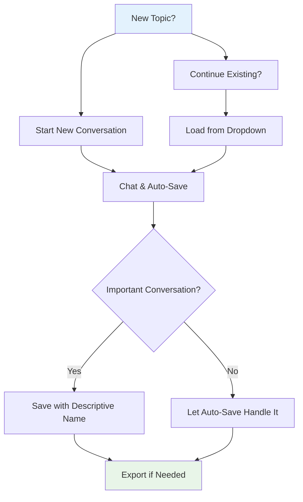

# Conversation Management

Learn how to save, load, and manage your chat conversations in Convoscope.

## Overview

Convoscope automatically saves your conversations and provides tools to manage them effectively. Never lose important chats again!

[{: target="_blank"}](../assets/screenshots/02-full-interface.png)
*Conversation management in the sidebar - click to enlarge*

## Auto-Save Feature

### How It Works

- **Automatic saving**: Every message is saved as you chat
- **No data loss**: Conversations persist even if you close the browser
- **Instant recovery**: Refresh the page and your conversation is still there
- **Backup system**: Multiple backup copies prevent data corruption

### What Gets Saved

- All messages (yours and AI responses)
- Timestamps for each message
- Provider information (which AI responded)
- Conversation metadata (length, tokens used)

## Manual Save & Load

### Saving Conversations

1. **Click "Save Conversation"** in the sidebar
2. **Enter a descriptive name** (e.g., "Python Help Session", "Creative Writing Ideas")
3. **Click Save** - conversation is permanently stored
4. **See confirmation** - green message shows save was successful

### Loading Conversations

1. **Use the dropdown menu** in the sidebar
2. **Select any saved conversation** from the list
3. **Conversation loads instantly** - all previous messages appear
4. **Continue chatting** - add new messages to the loaded conversation

### Best Practices for Naming

- **Use descriptive names**: "React Debug Session" vs "Conversation 1"
- **Include dates**: "Marketing Ideas - March 2024"
- **Add topics**: "Python Tutorial - Loops and Functions"
- **Keep it short**: Names appear in dropdown, so be concise

## Conversation File Management

### Where Conversations Are Stored

```
convoscope/
└── conversation_history/
    ├── auto_backup.json          # Latest auto-save
    ├── my_python_help.json       # Your saved conversations
    ├── creative_writing.json
    └── debugging_session.json
```

### File Format

Conversations are saved as JSON files with this structure:

```json
{
  "conversation_name": "Python Help Session",
  "timestamp": "2024-01-15T10:30:00Z",
  "messages": [
    {
      "role": "user",
      "content": "How do I create a list in Python?",
      "timestamp": "2024-01-15T10:30:15Z"
    },
    {
      "role": "assistant",
      "content": "You can create a list in Python using square brackets...",
      "timestamp": "2024-01-15T10:30:18Z",
      "provider": "openai",
      "model": "gpt-3.5-turbo"
    }
  ],
  "metadata": {
    "total_messages": 12,
    "providers_used": ["openai", "anthropic"],
    "conversation_length": "45 minutes"
  }
}
```

## Exporting Conversations

### HTML Export

Create beautiful, shareable HTML files of your conversations:

1. **Click "Export to HTML"** in the sidebar
2. **Choose conversation** to export
3. **File downloads automatically** with styled formatting
4. **Open in any browser** - no special software needed

### Export Features

- **Formatted text**: Proper styling with code blocks, lists, etc.
- **Timestamps**: When each message was sent
- **Provider info**: Which AI responded to each message
- **Responsive design**: Looks great on desktop and mobile
- **Printable**: Clean format for printing conversations

### Example Export

The exported HTML includes:
- **Header**: Conversation name, date, duration
- **Message threads**: Clean back-and-forth format
- **Syntax highlighting**: Code blocks are properly formatted
- **Metadata**: Total messages, providers used, etc.

## Managing Multiple Conversations

### Conversation Organization



### When to Start New Conversations

- **New topics**: Different subject matter
- **New projects**: Each project gets its own chat
- **Context switches**: When you need fresh context
- **Performance**: Very long chats can slow down the interface

### When to Continue Existing

- **Follow-up questions**: Building on previous responses
- **Iterative work**: Refining ideas or code
- **Context important**: When AI needs to remember previous discussion

## Advanced Features

### Backup and Recovery

**Automatic Backups**:
- Created every few minutes during active chats
- Stored as `auto_backup.json`
- Restored automatically if main conversation fails

**Manual Recovery**:
1. Check `conversation_history/` folder
2. Look for `.backup` files
3. Rename to `.json` and load manually if needed

### Conversation Merging

If you need to combine conversations:

1. **Export both as HTML**
2. **Copy content between files**
3. **Save as new conversation**
4. **Delete originals if no longer needed**

### Bulk Operations

For managing many conversations:

```bash
# List all conversations
ls conversation_history/*.json

# Find conversations by content
grep -l "Python" conversation_history/*.json

# Archive old conversations
mkdir archive_2023
mv conversation_history/old_*.json archive_2023/
```

## Storage Limits and Cleanup

### Managing Storage

- **File sizes**: Large conversations (1000+ messages) may slow interface
- **Disk space**: JSON files are text-based, so quite compact
- **Performance**: Consider archiving very old conversations

### Cleanup Strategies

1. **Regular exports**: Export important chats to HTML for archive
2. **Delete test chats**: Remove experimental or test conversations
3. **Archive by date**: Move old conversations to dated folders
4. **Keep essentials**: Maintain frequently-referenced conversations

## Troubleshooting

### Common Issues

**Conversation Won't Save**:
- Check file permissions on `conversation_history/` folder
- Verify disk space available
- Look for error messages in interface

**Can't Load Conversation**:
- File may be corrupted - check backup files
- JSON syntax error - validate file format
- File permissions issue - check read access

**Missing Conversations**:
- Check `conversation_history/` folder exists
- Look for `.backup` files
- Verify file names match dropdown list

### Recovery Steps

1. **Check auto-backup**: `conversation_history/auto_backup.json`
2. **Look for backup files**: Files ending in `.backup`
3. **Validate JSON**: Use online JSON validator if needed
4. **Restart application**: Sometimes fixes loading issues

---

**Need more help?** Check the [Troubleshooting Guide](troubleshooting.md) for additional solutions.