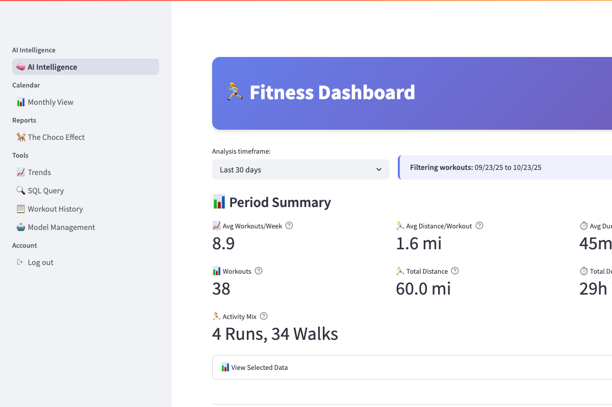
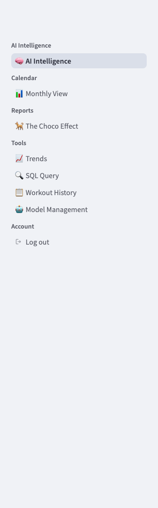

# Interface Guide

Learn how to use Convoscope's chat interface effectively.

## Main Interface Overview

[{: target="_blank"}](../assets/screenshots/01-main-interface.png)
*Complete Convoscope interface - click to enlarge*

The Convoscope interface consists of three main areas:

## 1. Chat Area (Center)

This is where your conversations happen:

- **Message bubbles**: Your messages appear on the right, AI responses on the left
- **Streaming responses**: AI responses appear word-by-word in real-time
- **Conversation history**: Scroll up to see previous messages
- **Auto-scroll**: Interface automatically scrolls to new messages

### Sending Messages

1. Type your message in the text box at the bottom
2. Press **Enter** or click the send button
3. Watch for the AI response to stream in
4. Continue the conversation naturally

## 2. Sidebar (Left)

[{: target="_blank"}](../assets/screenshots/06-sidebar-configuration.png)
*Sidebar controls - click to enlarge*

The sidebar contains all your controls and settings:

### Provider Selection

[{: target="_blank"}](../assets/screenshots/02-provider-selector-open.png)
*Provider dropdown menu - click to enlarge*

- **Provider dropdown**: Choose between OpenAI, Anthropic, or Google
- **Status indicators**: Green ✅ means provider is ready
- **Model selection**: Each provider offers different AI models
- **Automatic fallback**: If your selected provider fails, others will take over

### Conversation Management

- **Save conversation**: Give your chat a custom name and save it
- **Load conversation**: Resume previous conversations from the dropdown
- **New conversation**: Start fresh (clears current chat)
- **Export options**: Download conversations as HTML files

### Settings

- **Temperature**: Control AI creativity (0.0 = focused, 1.0 = creative)
- **Max tokens**: Set maximum response length
- **Stream responses**: Toggle real-time vs complete responses

## 3. Status Area (Bottom)

- **Provider status**: Shows which AI provider is currently responding
- **Error messages**: Clear, helpful error messages when things go wrong
- **Connection status**: Indicates if the app is connected properly

## Using Multiple Providers

### Provider Status Indicators

- ✅ **Green check**: Provider is ready and working
- ⚠️ **Yellow warning**: Provider has issues but may work
- ❌ **Red X**: Provider is unavailable

### Switching Providers

1. **Manual switching**: Use the dropdown to select a different provider
2. **Automatic fallback**: If your provider fails, Convoscope automatically tries others
3. **Seamless experience**: Your conversation continues regardless of which provider responds

### Example Workflow

## Error Handling

[{: target="_blank"}](../assets/screenshots/04-error-handling-stAlert.png)
*Friendly error messages - click to enlarge*

When something goes wrong, Convoscope shows helpful messages:

- **API key issues**: Clear instructions on how to fix authentication
- **Rate limits**: Explains when to try again
- **Network problems**: Suggests checking connection
- **Provider outages**: Shows which providers are available

## Mobile Interface

[{: target="_blank"}](../assets/screenshots/05-mobile-interface.png)
*Mobile-responsive design - click to enlarge*

Convoscope works great on mobile devices:

- **Responsive design**: Layout adapts to screen size
- **Touch-friendly**: Large buttons and easy scrolling
- **Same features**: All functionality available on mobile

## Keyboard Shortcuts

- **Enter**: Send message
- **Shift + Enter**: New line in message
- **Ctrl/Cmd + K**: Clear conversation (if implemented)

## Tips for Better Conversations

### Getting Better Responses

1. **Be specific**: Clear questions get better answers
2. **Provide context**: Reference previous parts of conversation
3. **Try different providers**: Each AI has different strengths
4. **Adjust temperature**: Lower for factual, higher for creative responses

### Managing Long Conversations

1. **Save regularly**: Don't lose important conversations
2. **Export when needed**: Download conversations for reference
3. **Start new chats**: Fresh conversations for new topics
4. **Use descriptive names**: Make saved conversations easy to find

## Troubleshooting Interface Issues

### Chat Not Responding
1. Check provider status indicators
2. Verify internet connection
3. Try switching providers
4. Check error messages in status area

### Sidebar Not Working
1. Refresh the page
2. Check browser console for errors
3. Verify all providers are configured

### Mobile Issues
1. Try landscape orientation
2. Refresh the page
3. Check mobile browser compatibility

---

**Need more help?** Check the [Troubleshooting Guide](troubleshooting.md) for common issues and solutions.