# Convoscope: Multi-Provider AI Chat

## What is Convoscope?

Convoscope is a reliable AI chat application that automatically switches between multiple AI providers (OpenAI, Anthropic, Google) to ensure your conversations never get interrupted. When one AI service is down or slow, Convoscope seamlessly falls back to another provider so you can keep chatting.

[{: target="_blank"}](assets/screenshots/01-hero-interface.png)
*Click image to view full size*

## Why Use Convoscope?

- **🔄 Never get stuck**: If OpenAI is down, automatically switch to Claude or Gemini
- **💾 Save conversations**: Keep your chat history and reload sessions anytime
- **🎯 Simple setup**: Works with just one API key, supports three providers
- **🛡️ Built for reliability**: Smart error handling and automatic retries

## Quick Start

Get up and running in 3 minutes:

```bash
# 1. Clone and install
git clone https://github.com/dagny099/convoscope.git
cd convoscope
pip install -r requirements.txt

# 2. Set your API key (choose one)
export OPENAI_API_KEY="sk-your-key-here"
# OR export ANTHROPIC_API_KEY="sk-ant-your-key-here"
# OR export GEMINI_API_KEY="your-gemini-key-here"

# 3. Run the app
streamlit run run_chat.py
```

The app will open in your browser at `http://localhost:8501`

📖 **Need more details?** See the [Installation Guide](guides/installation.md)

## How Multi-Provider Switching Works

When you send a message, Convoscope intelligently routes your request:


*[📊 View detailed data flow →](architecture/data-flow.md){: target="_blank"}*

## Key Features

### Multiple AI Providers
Choose from three leading AI providers:

- **OpenAI** (GPT-4, GPT-3.5) - Most popular, fast responses
- **Anthropic** (Claude) - Great reasoning, longer context
- **Google** (Gemini) - Cost-effective, multimodal

When one provider is unavailable, Convoscope automatically switches to another, ensuring uninterrupted conversations.

### Conversation Management

- Save conversations with custom names
- Load previous chat sessions
- Export conversations to HTML
- Auto-backup prevents data loss

### Mobile-Friendly Design

Responsive interface that works seamlessly on desktop, tablet, and mobile devices with consistent functionality across all platforms.

!!! info "Screenshots being updated"
    Additional screenshots showing provider selection, error handling, mobile interface, and other features are currently being updated to reflect the latest UI improvements. See the [Visual Assets Index](visual-assets-index.md) for status updates.

## System Architecture

Simple, reliable architecture that just works:

```mermaid
flowchart TB
    subgraph Frontend ["🎨 User Interface"]
        UI["📱 Streamlit App"]
    end

    subgraph Backend ["⚙️ Core Services"]
        LLM["🤖 Multi-Provider LLM"]
        CONV["💬 Conversation Manager"]
    end

    subgraph External ["🌐 AI Providers"]
        OPENAI["🔥 OpenAI"]
        ANTHROPIC["🧠 Anthropic"]
        GOOGLE["🌟 Google"]
    end

    UI --> LLM
    UI --> CONV
    LLM --> OPENAI
    LLM --> ANTHROPIC
    LLM --> GOOGLE

    classDef frontend fill:#e3f2fd,stroke:#1976d2,stroke-width:2px
    classDef backend fill:#f3e5f5,stroke:#7b1fa2,stroke-width:2px
    classDef external fill:#e8f5e8,stroke:#388e3c,stroke-width:2px

    class UI frontend
    class LLM,CONV backend
    class OPENAI,ANTHROPIC,GOOGLE external
```



*[🏗️ View detailed system architecture →](architecture/system-overview.md){: target="_blank"}*

## Getting Started

### **📚 Documentation Guide**

=== "🚀 New Users"

    **Just want to use the app?**

    1. **[📖 Installation Guide](guides/installation.md)** - Complete setup instructions
    2. **[⚡ Quick Setup](guides/quick-setup.md)** - 5-minute start (coming soon)
    3. **[🎯 Multi-Provider Setup](guides/multi-provider-setup.md)** - Configure all three providers

=== "⚙️ Configuration"

    **Need to customize settings?**

    1. **[🔧 Basic Configuration](guides/configuration.md)** - Environment variables and settings
    2. **[🛠️ Advanced Usage](guides/advanced-usage.md)** - Custom configurations
    3. **[❓ Troubleshooting](guides/troubleshooting.md)** - Common issues and solutions

=== "🏗️ Technical Details"

    **Want to understand how it works?**

    1. **[🏛️ System Architecture](architecture/system-overview.md)** - Complete technical design
    2. **[🔄 Data Flow](architecture/data-flow.md)** - Request processing pipeline
    3. **[📋 API Reference](api/llm-service.md)** - Detailed implementation docs

## What Makes Convoscope Reliable?

Unlike single-provider chat apps that fail when their AI service is down, Convoscope implements **intelligent fallback**:

```mermaid
graph TD
    A[User sends message] --> B{OpenAI available?}
    B -->|✅ Yes| C[Get OpenAI response]
    B -->|❌ No| D{Anthropic available?}
    D -->|✅ Yes| E[Get Claude response]
    D -->|❌ No| F{Google available?}
    F -->|✅ Yes| G[Get Gemini response]
    F -->|❌ No| H[Show helpful error]

    C --> I[Display response to user]
    E --> I
    G --> I

    style A fill:#e3f2fd
    style I fill:#e8f5e8
    style H fill:#ffebee
```



*[🔍 Learn more about the reliability architecture →](architecture/system-overview.md#reliability-improvements){: target="_blank"}*

## Support

- **📖 Documentation**: Browse the guides above for comprehensive help
- **💬 Issues**: Found a bug? Check the troubleshooting guide first
- **🔧 Configuration**: Need help with setup? See the configuration guides

---

*Ready to get started? Begin with the [Installation Guide →](guides/installation.md)*