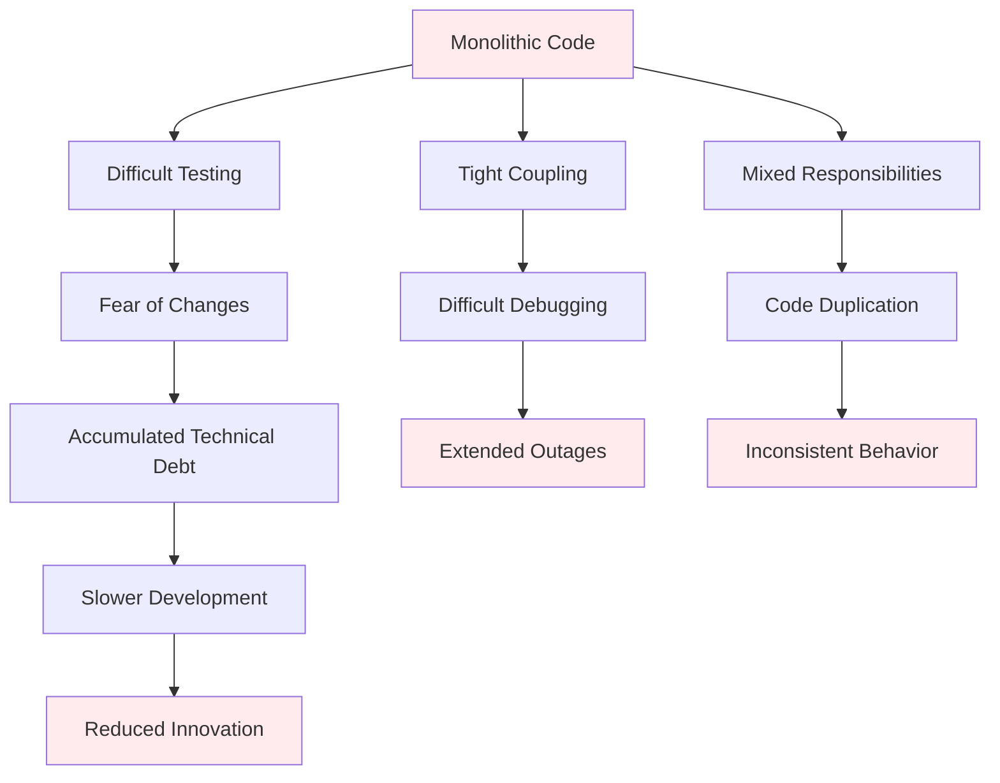

# Problem Statement

## The Challenge: From Functional Prototype to Portfolio-Ready Application

### Original State Assessment

When I inherited this Streamlit chat application, it represented a common scenario in rapid prototyping: **functional but unmaintainable**. The application worked well for demonstrating concept viability, but it exhibited several critical issues that prevented it from serving as a professional portfolio piece.

#### Core Problems Identified

=== "🏗️ Architecture Issues"

    **Monolithic Structure**
    ```python
    # run_chat.py - 696 lines of mixed concerns
    def load_convo():     # Line 116
    def choose_convo():   # Line 141  
    def save_convo():     # Line 172
    def get_index():      # Line 198
    def update_priming_text(): # Line 208
    def topic_extraction():   # Line 220
    def sidebar_configuration(): # Line 249 (200+ lines!)
    def stream_openai_response(): # Line 355
    def main():          # Line 544
    ```
    
    - **Single responsibility violation**: UI, business logic, and data access mixed together
    - **Code duplication**: Similar patterns repeated throughout the file
    - **Tight coupling**: Impossible to test individual components in isolation

=== "🧪 Quality Assurance"

    **Zero Testing Infrastructure**
    ```bash
    $ find . -name "*test*" -type f
    # No results - no testing framework at all
    
    $ python -m pytest
    # No tests to run
    ```
    
    - **No unit tests**: Critical business logic completely untested
    - **No integration tests**: Multi-component interactions unverified  
    - **No error handling validation**: Edge cases and failures unhandled
    - **No regression protection**: Changes could break existing functionality

=== "⚡ Reliability Concerns"

    **Single Point of Failure**
    ```python
    # Original LLM integration - brittle and unreliable
    llm = OpenAI(api_key=os.getenv("OPENAI_API_KEY"), 
                 model="gpt-3.5-turbo")
    response = llm.stream_chat(messages)  # What if this fails?
    ```
    
    - **No fallback providers**: Complete failure if OpenAI is unavailable
    - **No retry logic**: Temporary failures cause permanent chat interruption
    - **Poor error messaging**: Users see technical errors instead of helpful guidance
    - **No input validation**: Malformed requests could crash the application

=== "📊 Maintainability"

    **Technical Debt Accumulation**
    - **Hardcoded values**: Configuration scattered throughout the codebase
    - **No separation of concerns**: Business rules mixed with presentation logic
    - **Inconsistent patterns**: Different approaches to similar problems
    - **Documentation gaps**: No architectural documentation or API references

## Impact on Professional Presentation

### Portfolio Assessment Concerns

The original codebase presented several red flags that would concern potential employers:

1. **Scale Readiness**: Could this developer handle enterprise-scale applications?
2. **Code Quality**: Does this developer understand professional development practices?
3. **Testing Mindset**: How would this developer ensure reliability in production systems?
4. **System Design**: Can this developer architect maintainable, extensible systems?

### Technical Debt Implications



## Success Criteria Definition

### Primary Objectives

To transform this functional prototype into a **portfolio-worthy demonstration** of professional software engineering capabilities:

!!! success "Portfolio Impact Goals"
    
    **Technical Excellence**
    - Demonstrate modular architecture and clean code principles
    - Show comprehensive testing strategy and implementation
    - Exhibit professional error handling and resilience patterns
    
    **System Design Expertise**  
    - Multi-provider integration with intelligent fallback logic
    - Scalable service architecture with proper abstraction layers
    - Production-ready configuration and deployment considerations
    
    **Quality Engineering**
    - Test-driven development methodology  
    - Continuous integration and automated quality assurance
    - Professional documentation and communication practices

### Measurable Outcomes

| Dimension | Before | Target | Success Metric |
|-----------|---------|---------|----------------|
| **Code Organization** | 1 file, 696 lines | Modular architecture | <50 lines per function |
| **Test Coverage** | 0% (no tests) | >90% coverage | Comprehensive test suite |
| **Error Handling** | Basic try/catch | Production-ready | Graceful degradation |
| **Provider Support** | OpenAI only | Multi-provider | 3+ providers with fallback |
| **Documentation** | Minimal README | Complete docs | Architecture + API docs |

## Strategic Transformation Approach

### Phase-Based Improvement Strategy

Rather than a complete rewrite, I chose a **systematic refactoring approach** that:

1. **Preserves functionality** while improving architecture
2. **Introduces testing** at each refactoring step  
3. **Demonstrates methodology** that scales to larger projects
4. **Maintains working system** throughout the transformation process

This approach showcases not just the final result, but the **professional engineering process** used to achieve systematic improvement.

### Portfolio Differentiation

Most portfolio projects demonstrate either:
- **"Greenfield" development**: Building something new from scratch
- **"Feature addition"**: Adding capabilities to existing projects

This project demonstrates **"Legacy improvement"**: The challenging skill of taking working-but-problematic code and transforming it into maintainable, testable, scalable architecture.

This mirrors real-world scenarios where developers must improve existing systems while maintaining business continuity—a critical skill in professional software development environments.

---

*Next: [Technical Approach](technical-approach.md) - How systematic engineering practices transformed the codebase*