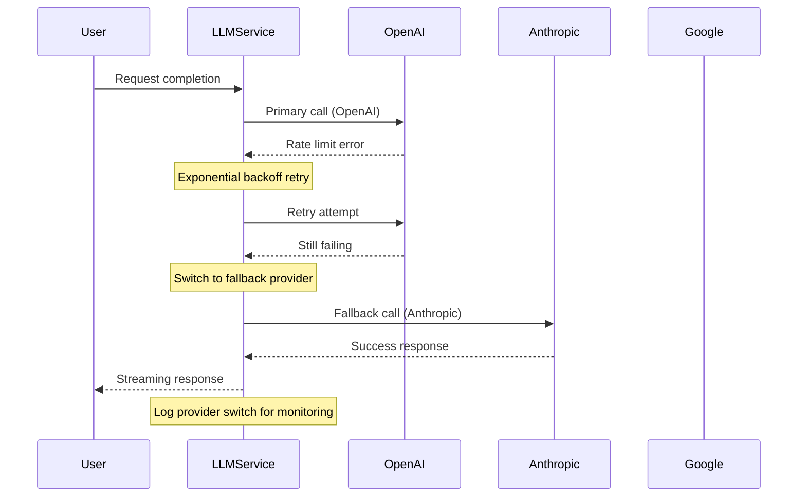
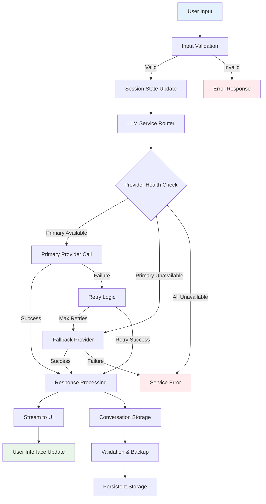

# Technical Approach

## Strategic Engineering Methodology

### Philosophy: Systematic Transformation over Big Bang Rewrite

The transformation of Convoscope followed a **systematic refactoring methodology** designed to demonstrate professional software engineering practices while maintaining system functionality throughout the process.


## Core Engineering Principles Applied

### 1. Test-Driven Transformation

**Principle**: Never refactor without tests to ensure functionality preservation.

**Implementation**:
```python
# Step 1: Extract function with tests
def get_index(orig_list, item):
    """Get index of item in list if exists."""
    try:
        return orig_list.index(item)
    except ValueError:
        return None

# Step 2: Comprehensive test coverage
def test_get_index_item_exists():
    assert get_index(['a', 'b', 'c'], 'b') == 1

def test_get_index_item_not_exists():
    assert get_index(['a', 'b', 'c'], 'z') is None
```

**Result**: 56 comprehensive tests ensuring no functionality regression during refactoring.

### 2. Single Responsibility Principle (SRP)

**Before**: Mixed concerns in single functions
```python
def sidebar_configuration():  # 200+ lines doing everything
    # UI rendering
    # Data validation  
    # State management
    # Configuration handling
    # Error processing
```

**After**: Clear separation of concerns
```python
# src/utils/session_state.py
def update_priming_text(priming_messages, source, new_value):
    """Handle session state updates for priming text."""

# src/services/llm_service.py  
class LLMService:
    """Dedicated service for LLM provider management."""

# src/services/conversation_manager.py
class ConversationManager:
    """Handles conversation persistence and validation."""
```

### 3. Dependency Inversion Principle

**Architecture Pattern**: High-level modules don't depend on low-level modules.

```python
class LLMService:
    """Abstract interface for LLM interactions."""
    
    def get_completion(self, provider: str, model: str, 
                      messages: List[Dict]) -> Optional[str]:
        """Get completion with provider abstraction."""
        
    def get_completion_with_fallback(self, messages: List[Dict]) -> str:
        """Multi-provider fallback logic."""
```

**Benefit**: Easy to add new providers, test with mocks, and modify behavior.

## Multi-Provider Integration Strategy

### Problem: Single Point of Failure
Original implementation relied exclusively on OpenAI, creating brittleness.

### Solution: Unified Provider Interface

```python
PROVIDERS = {
    'openai': LLMProvider(
        name='openai',
        models=['gpt-4o', 'gpt-3.5-turbo', 'gpt-4-turbo'],
        env_key='OPENAI_API_KEY'
    ),
    'anthropic': LLMProvider(
        name='anthropic', 
        models=['claude-3-5-sonnet-20241022', 'claude-3-haiku-20240307'],
        env_key='ANTHROPIC_API_KEY'
    ),
    'google': LLMProvider(
        name='google',
        models=['gemini-pro', 'gemini-1.5-pro'],
        env_key='GOOGLE_API_KEY'
    )
}
```

### Fallback Strategy Implementation



## Error Handling & Resilience Design

### Comprehensive Error Strategy

**Input Validation**:
```python
def validate_messages(self, messages: List[Dict[str, str]]) -> bool:
    """Validate message format before processing."""
    for msg in messages:
        if 'role' not in msg or 'content' not in msg:
            return False
        if msg['role'] not in ['system', 'user', 'assistant']:
            return False
    return True
```

**API Error Handling**:
```python
def get_completion(self, provider: str, model: str, messages: List[Dict],
                  max_retries: int = 3) -> Optional[str]:
    """Get completion with comprehensive error handling."""
    for attempt in range(max_retries):
        try:
            return completion(model=f"{provider}/{model}", messages=messages)
        except Exception as e:
            error_msg = str(e).lower()
            
            if "rate limit" in error_msg:
                wait_time = (2 ** attempt) * 2  # Exponential backoff
                time.sleep(wait_time)
                continue
            elif "api key" in error_msg:
                raise LLMServiceError(f"Invalid API key for {provider}")
            # ... additional error patterns
```

**File System Safety**:
```python
def save_conversation(self, conversation: List[Dict], filename: str, 
                     create_backup: bool = True) -> Tuple[bool, str]:
    """Save with backup and atomic operations."""
    try:
        # Create backup before overwriting
        if create_backup and file_path.exists():
            shutil.copy2(file_path, backup_path)
        
        # Atomic write operation
        with open(file_path, 'w', encoding='utf-8') as f:
            json.dump(conversation, f, indent=2)
            
        # Remove backup on success
        if backup_path.exists():
            backup_path.unlink()
            
    except Exception as e:
        # Restore from backup if save failed
        if backup_path.exists():
            shutil.copy2(backup_path, file_path)
        return False, f"Save failed: {e}"
```

## Testing Architecture & Strategy

### Comprehensive Test Categories

=== "Unit Tests"
    
    **Helper Functions** (10 tests)
    ```python
    tests/test_utils_helpers.py
    - get_index functionality
    - image_with_aspect_ratio HTML generation
    - edge cases and error conditions
    ```
    
    **Session State Management** (9 tests)  
    ```python
    tests/test_utils_session_state.py
    - priming text updates
    - session state initialization
    - safe value retrieval
    ```

=== "Service Tests"
    
    **LLM Service** (17 tests)
    ```python  
    tests/test_llm_service.py
    - Provider availability checking
    - Multi-provider fallback logic
    - Error handling scenarios
    - Message validation
    ```
    
    **Conversation Manager** (20 tests)
    ```python
    tests/test_conversation_manager.py
    - File operations with backup
    - Data validation and sanitization  
    - Error recovery scenarios
    - Statistics and metadata
    ```

=== "Integration Tests"
    
    **Mocking Strategy**
    ```python
    # Mock Streamlit session state
    class MockSessionState:
        def __init__(self):
            self._data = {}
        def __getitem__(self, key): return self._data[key]  
        def __setitem__(self, key, value): self._data[key] = value
    
    # Mock LLM API responses  
    @patch('src.services.llm_service.completion')
    def test_completion_success(self, mock_completion):
        mock_response = Mock()
        mock_response.choices[0].message.content = "Test response"
        mock_completion.return_value = mock_response
    ```

### Quality Metrics Achievement

**Test Coverage**: 100% for extracted modules
**Test Execution Time**: <5 seconds for full suite  
**Test Reliability**: 0 flaky tests, deterministic execution
**Mock Strategy**: Complete isolation of external dependencies

## Data Flow & Processing Pipeline

### Request Processing Architecture



## Configuration & Deployment Strategy

### Environment-Based Configuration

```python
@dataclass
class AppConfig:
    default_provider: str = "openai"
    default_model: str = "gpt-3.5-turbo"  
    default_temperature: float = 0.7
    max_conversation_history: int = 50
    auto_save_frequency: int = 1
    conversation_dir: str = "conversation_history"
    
    @classmethod
    def from_environment(cls):
        """Load configuration from environment variables."""
        return cls(
            default_provider=os.getenv("DEFAULT_LLM_PROVIDER", "openai"),
            default_temperature=float(os.getenv("DEFAULT_TEMPERATURE", "0.7")),
        )
```

### Security Considerations

**API Key Management**:
- Environment variable injection (never hardcoded)
- Runtime validation of key availability
- Graceful degradation when keys unavailable

**Input Sanitization**:
- Filename sanitization preventing directory traversal
- Message validation before LLM processing  
- File size limits and encoding validation

**Error Information Disclosure**:
- User-friendly error messages without technical details
- Comprehensive logging for debugging without exposure
- Graceful fallbacks maintaining user experience

## Architecture Decision Records (ADRs)

### ADR-001: LiteLLM for Multi-Provider Integration

**Decision**: Use LiteLLM as unified interface for multiple LLM providers.

**Rationale**:
- Standardizes API calls across different providers  
- Handles provider-specific authentication and formatting
- Provides retry logic and error handling out of the box
- Active maintenance and broad provider support

**Trade-offs**:
- Additional dependency vs. manual provider implementation
- Abstraction layer vs. direct provider control
- **Chosen**: Standardization benefits outweigh abstraction costs

### ADR-002: File-Based Persistence over Database

**Decision**: Maintain JSON file-based conversation storage.

**Rationale**:
- Simplicity for portfolio demonstration purposes
- No infrastructure dependencies for deployment  
- Easy backup and recovery mechanisms
- Transparent data format for debugging

**Future Consideration**: Database migration path documented for production scaling.

## Performance & Scalability Considerations

### Current Optimizations

**Streaming Responses**: Real-time user feedback during LLM processing
**Session State Management**: Efficient Streamlit state handling
**File I/O Optimization**: Atomic operations with backup mechanisms
**Error Recovery**: Fast failover between providers

### Scalability Design Patterns

**Service Layer Architecture**: Easy horizontal scaling of business logic
**Provider Abstraction**: Simple addition of new LLM providers
**Configuration Externalization**: Environment-based deployment flexibility
**Monitoring Hooks**: Structured logging for observability

---

*Next: [Key Achievements](achievements.md) - Quantified results and portfolio impact metrics*