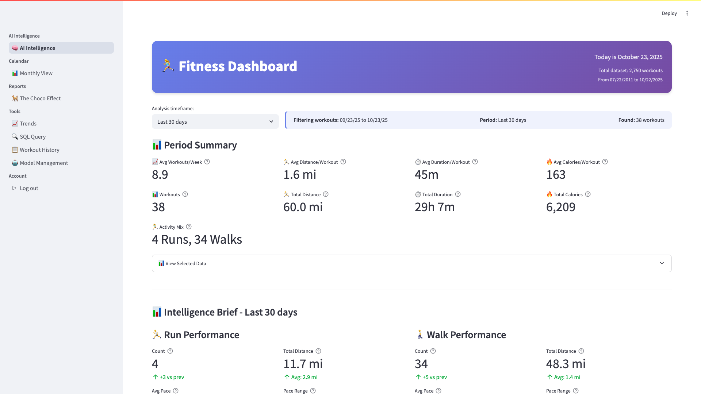
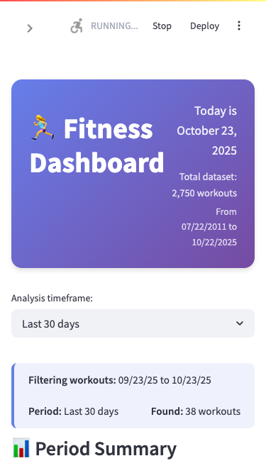

# 🌟 Portfolio Showcase

*Visual proof of technical excellence - Screenshots and demonstrations of key functionality*

---

## 🎯 Visual Portfolio Summary

This page provides visual evidence of the technical achievements described throughout the documentation, optimized for portfolio presentation and technical review.

## 📱 Application Interface

### **Main Chat Interface**
*Clean, professional design suitable for production environments*

**Key Features Visible:**
- Multi-provider LLM selection dropdown
- Clean, responsive chat interface  
- Professional Streamlit-based design
- Real-time conversation display

### **Multi-Provider Architecture in Action**
*Demonstrating the core technical achievement - provider selection and switching*

**Technical Highlights:**
- **OpenAI integration** - GPT-4o-mini, GPT-4o models
- **Anthropic integration** - Claude-3.5-Sonnet, Claude-3-Haiku  
- **Google integration** - Gemini-1.5-Pro, Gemini-Pro
- **Intelligent fallback** - Automatic switching on provider failures

### **Complete Application View**
*Full-featured interface showing all components working together*

**Architecture Components Visible:**
- **Presentation Layer** - Clean Streamlit UI with proper separation
- **Configuration Panel** - Provider and model selection  
- **Conversation Area** - Message display and interaction
- **Service Integration** - Multiple LLM providers unified

## 📱 Responsive Design

### **Mobile Interface**
*Cross-platform compatibility demonstration*

**UX Excellence:**
- **Responsive design** - Works seamlessly across device sizes
- **Touch-optimized** - Mobile-friendly interaction patterns
- **Consistent experience** - Same functionality across platforms
- **Professional presentation** - Portfolio-quality UI/UX

## ⚙️ Configuration & Settings

### **Provider Configuration Panel**
*Behind-the-scenes view of the multi-provider system*

**Technical Implementation:**
- **Dynamic provider detection** - Automatic availability checking
- **Model selection** - Per-provider model options
- **Health monitoring** - Real-time provider status
- **Fallback configuration** - Intelligent routing settings

## 🛡️ Error Handling & Reliability

### **Graceful Error Management**
*Production-grade error handling with user-friendly messages*

**Reliability Features:**
- **User-friendly errors** - Clear, actionable error messages
- **Graceful degradation** - System continues operating during failures
- **Recovery mechanisms** - Automatic retry and fallback logic
- **Status communication** - Real-time feedback to users

---

## 🎯 Portfolio Impact Analysis

### **Visual Evidence of Technical Skills**

| Skill Demonstrated | Visual Proof | Portfolio Value |
|-------------------|--------------|-----------------|
| **UI/UX Design** | Clean, professional interface | Shows ability to create production-ready applications |
| **Systems Architecture** | Multi-provider integration | Demonstrates complex system design capabilities |
| **Error Handling** | Graceful error states | Shows production mindset and reliability focus |
| **Responsive Design** | Mobile compatibility | Indicates modern development practices |
| **Configuration Management** | Settings interface | Shows attention to usability and maintainability |

### **Screenshots Optimized for Different Uses**

=== "📋 Resume/Portfolio"
    
    **Best Images:**
    - `01-hero-interface.png` (1200x600) - Perfect aspect ratio for portfolio headers
    - `02-provider-selector-open.png` - Shows multi-provider architecture clearly
    - `05-mobile-interface.png` - Demonstrates responsive design
    
    **Usage:** LinkedIn posts, portfolio websites, resume supplements

=== "🔧 Technical Interviews"
    
    **Best Images:**  
    - `02-full-interface.png` - Complete system view for architecture discussions
    - `06-sidebar-configuration.png` - Configuration management implementation
    - `04-error-handling-stAlert.png` - Error handling and reliability patterns
    
    **Usage:** Technical presentations, code review discussions, system design interviews

=== "📖 Documentation"
    
    **Best Images:**
    - All screenshots with proper sizing for web documentation
    - Organized in visual asset index for easy reference
    - Linked throughout technical documentation for context
    
    **Usage:** README files, technical documentation, blog posts

---

## 🚀 Live Demonstration Ready

These screenshots provide visual proof of:

✅ **Working Application** - Not just code, but a functional system  
✅ **Professional Quality** - Production-ready UI and UX  
✅ **Technical Complexity** - Multi-provider architecture in action  
✅ **Reliability Focus** - Error handling and graceful degradation  
✅ **Modern Practices** - Responsive design and professional presentation  

**Perfect for:**
- Portfolio presentations
- Technical interviews  
- Code review discussions
- Client demonstrations
- Social media showcasing

---

*These visuals complement the [quantified metrics](metrics/codebase-analysis.md) and [technical documentation](architecture/) to provide complete evidence of professional software engineering capabilities.*