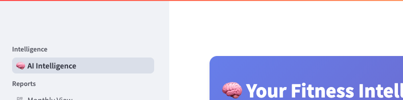

# Screenshots

Visual documentation of Convoscope's interface and functionality.

## Application Interface

### Main Chat Interface

**Features shown:**
- Multi-provider LLM selection dropdown
- Clean, responsive chat interface
- Real-time conversation display
- Professional Streamlit-based design

### Multi-Provider Selection

**Providers available:**
- **OpenAI** - GPT-4o-mini, GPT-4o models
- **Anthropic** - Claude-3.5-Sonnet, Claude-3-Haiku
- **Google** - Gemini-1.5-Pro, Gemini-Pro
- **Intelligent fallback** - Automatic switching on provider failures

### Complete Application View

**Architecture components:**
- **Presentation Layer** - Clean Streamlit UI
- **Configuration Panel** - Provider and model selection
- **Conversation Area** - Message display and interaction
- **Service Integration** - Multiple LLM providers unified

## Error Handling

### User-Friendly Error Messages

**Error handling features:**
- Clear, actionable error messages
- No technical jargon exposed to users
- Graceful degradation when providers fail
- Helpful guidance for common issues

## Cross-Platform Support

### Mobile Interface

**Mobile features:**
- Responsive design adapts to screen size
- Touch-friendly interface elements
- Full functionality on mobile devices
- Consistent behavior across platforms

### Configuration Interface

**Configuration options:**
- Provider selection and status
- Model selection per provider
- Temperature and token settings
- Conversation management tools

## Technical Implementation

All screenshots demonstrate:
- **Production-ready UI** - Professional appearance suitable for real-world use
- **Multi-provider architecture** - Seamless switching between AI services
- **Error resilience** - Graceful handling of failures and edge cases
- **Cross-platform compatibility** - Works on desktop and mobile devices

---

*Screenshots captured from live application running on macOS with Chrome browser*